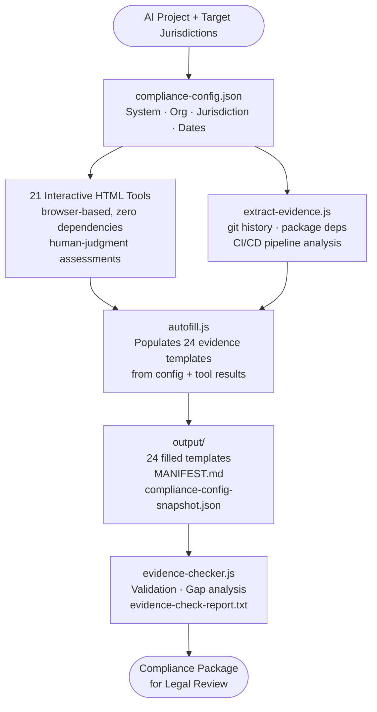

# AI Compliance Evidence Collection Kit


Open-source toolkit for gathering AI/LLM compliance evidence across 16+ jurisdictions. Built as a [Claude Code](https://claude.ai/claude-code) skill.

**[View the site](https://justice8096.github.io/LLMComplianceSkill/)** | **[Templates](#templates)** | **[Interactive Tools](#interactive-tools)** | **[Quick Start](#quick-start)**

---

## What This Is

When you build an AI-powered application, you need evidence that it complies with applicable regulations. This toolkit provides:

- **24 evidence templates** mapped to specific laws across 45+ regulations
- **21 interactive HTML tools** for compliance areas requiring human judgment
- **An autofill script** that populates templates from a single config file
- **3 automated evidence extractors** for git, package, and CI/CD analysis
- **Regulation research** covering 16 jurisdictions with specific provisions and deadlines

The output is designed to be **handed to your legal or compliance team** to help prove compliance.

## Installation

```bash
git clone git@github.com:justice8096/LLMComplianceSkill.git ~/.claude/plugins/LLMComplianceSkill
```

Or install alongside the full security audit suite:

```bash
git clone git@github.com:justice8096/sast-dast-scanner.git      ~/.claude/plugins/sast-dast-scanner
git clone git@github.com:justice8096/supply-chain-security.git   ~/.claude/plugins/supply-chain-security
git clone git@github.com:justice8096/cwe-mapper.git              ~/.claude/plugins/cwe-mapper
git clone git@github.com:justice8096/post-commit-audit.git       ~/.claude/plugins/post-commit-audit
git clone git@github.com:justice8096/LLMComplianceSkill.git      ~/.claude/plugins/LLMComplianceSkill
```

Claude Code auto-discovers skills in `~/.claude/plugins/`. No further configuration needed.

## Quick Start

```bash
git clone git@github.com:justice8096/LLMComplianceSkill.git
cd LLMComplianceSkill

# 1. Create your project config
cp tools/compliance-config.example.json tools/compliance-config.json
# Edit compliance-config.json with your project details

# 2. (Optional) Extract evidence automatically from your repo
node tools/extract-evidence.js --repo /path/to/your-repo --config tools/compliance-config.json

# 3. Open interactive tools in your browser
# Load compliance-config.json into each tool, make decisions, save results

# 4. Run autofill
node tools/autofill.js --config tools/compliance-config.json --output output/

# 5. Validate completeness
node tools/evidence-checker.js --config tools/compliance-config.json --output output/

# 6. Evidence is in output/
ls output/
```

## How It Works



No server required. Everything runs locally with zero external dependencies.

## Templates

| # | Template | Key Regulations |
|---|---------|----------------|
| 01 | System Transparency Document | EU AI Act Arts. 11-14, Colorado SB 24-205, UK DUA Act |
| 02 | User-Facing Disclosure Toolkit | EU AI Act Art. 50, Colorado, California, China |
| 03 | Content Labeling Spec | EU AI Act, China Content Labeling, California SB 942 |
| 04 | Automated Decision Logic | EU, UK, Colorado, Australia |
| 05 | Training Data Disclosure | EU GPAI, California AB 2013, UK, Australia |
| 06 | Impact/Risk Assessment | EU AI Act Art. 9, Colorado, South Korea |
| 07 | Privacy Impact Assessment | 20+ laws across 17 jurisdictions |
| 08 | Bias Testing | EU, UK, Colorado, NYC LL 144, California, Australia |
| 09 | Human Oversight Design | EU AI Act Art. 14, UK DUA Act, Australia |
| 10 | Consent Records | GDPR, UK GDPR, Australia, South Korea PIPA |
| 11 | Data Subject Rights | 14+ data protection laws globally |
| 12 | Governance Framework | EU, UK, Australia, Singapore, South Korea |
| 13 | Incident Management | EU, China, California SB 53, South Korea |
| 14 | Registration/Filing Tracker | EU, China CAC, Peru, South Korea |
| 15 | Security Assessment | EU AI Act Art. 15, China GenAI specs, UK |
| 16 | Content Moderation | China, India |
| 17 | Risk Classification | EU Annex III, Colorado, South Korea, Brazil, Peru |
| 18 | AI Literacy Training | EU Art. 4 (already enforceable) |
| 19 | Conformity Assessment | EU AI Act Arts. 9-15 |
| 20 | Sector-Specific Matrix | Finance, healthcare, employment, education |
| 21 | Jurisdiction Selector | Select countries → get required template list |
| 22 | Compliance Deadline Tracker | All deadlines through 2027+ |
| 23 | Supply Chain Risk | Foundation model provenance, vendor assessments |

## Interactive Tools

| Tool | Template | Purpose |
|------|---------|---------|
| `risk-classification.html` | 17 | Decision tree for prohibited/high-risk/limited classification |
| `impact-risk-scoring.html` | 06 | Fundamental rights impact + risk matrix scoring |
| `human-oversight.html` | 09 | Oversight model, override mechanisms, bias prevention |
| `bias-testing.html` | 08 | Protected characteristics, fairness metrics, findings |
| `consent-design.html` | 10 | Legal basis selection, consent mechanisms, lifecycle |
| `security-assessment.html` | 15 | Threat model, security controls, infrastructure audit |
| `pia-assessment.html` | 07 | Privacy impact assessment workflow |
| `transparency-documentation.html` | 01 | System transparency documentation |
| `disclosure-toolkit.html` | 02 | User-facing disclosure design |
| `content-labeling.html` | 03 | AI content labeling specification |
| `automated-decision-logic.html` | 04 | Automated decision logic documentation |
| `training-data-disclosure.html` | 05 | Training data provenance |
| `governance-framework.html` | 12 | AI governance structure |
| `incident-management.html` | 13 | Incident response plan |
| `content-moderation.html` | 16 | Content moderation policy |
| `conformity-assessment.html` | 19 | EU AI Act conformity assessment |
| `ai-literacy-training.html` | 18 | AI literacy training records |
| `consent-records-audit.html` | 10 | Consent records lifecycle audit |
| `dsr-rights-implementation.html` | 11 | Data subject rights implementation |
| `supply-chain-risk.html` | 23 | Supply chain risk assessment |
| `llm-selector.html` | — | Select and document the foundation model used |

## Jurisdictions Covered

| Tier | Jurisdictions |
|------|--------------|
| **Enacted** | EU (27 + EEA), South Korea, Peru, Vietnam, Brazil |
| **Active Sector** | China, United Kingdom, United States (CO, CA, NYC, IL, TX, UT) |
| **Proposed** | Canada, India, Japan, Nigeria, Mexico, Colombia, Chile |
| **Voluntary** | Australia, New Zealand, Singapore |

## Key Deadlines

| Date | Jurisdiction | Event |
|------|-------------|-------|
| **Feb 2025** | EU | AI Act — Prohibited practices + AI Literacy |
| **Aug 2025** | EU | AI Act — GPAI obligations |
| **Jan 2026** | US-CA | SB 53 + AB 2013 |
| **Feb 2026** | UK | DUA Act — ADM reforms |
| **Jun 2026** | US-CO | Colorado AI Act (SB 24-205) |
| **Aug 2026** | EU | AI Act — Full applicability |
| **Dec 2026** | AU | Privacy Act ADM obligations |

## Using as a Claude Code Skill

Add this as a skill to your Claude Code sessions when building AI-powered applications:

1. Install to `~/.claude/plugins/` (see [Installation](#installation))
2. When planning features, Claude will reference applicable regulations
3. Use the templates and tools to gather evidence alongside development
4. The skill prioritizes actionable requirements and cites specific laws

## Disclaimer

This toolkit supports compliance evidence gathering. **It is not legal advice.** Always have completed templates reviewed by qualified legal counsel. Regulations may have changed since the last research update (March 2026).

## License

MIT
